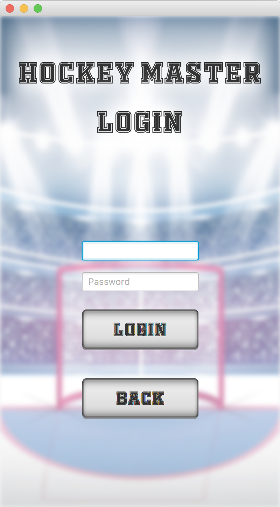
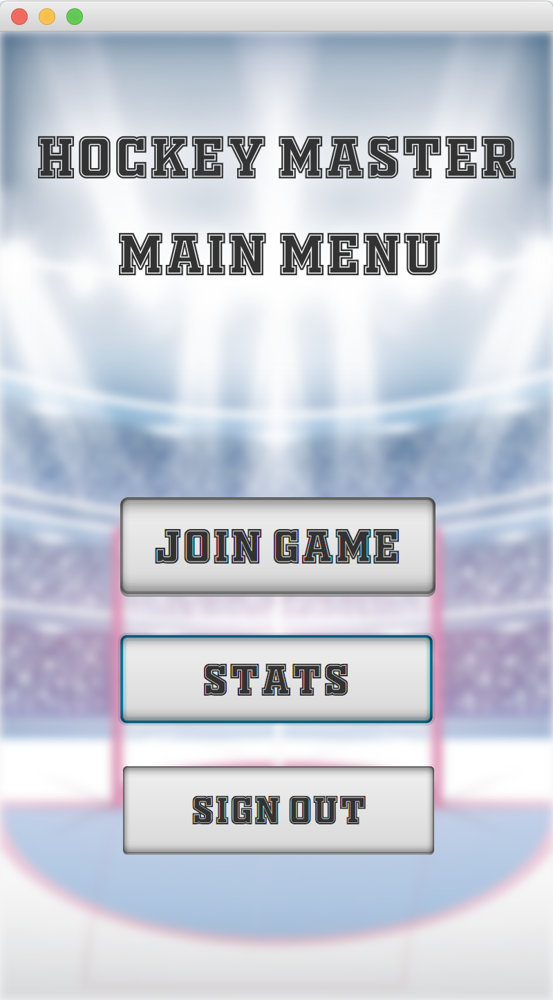
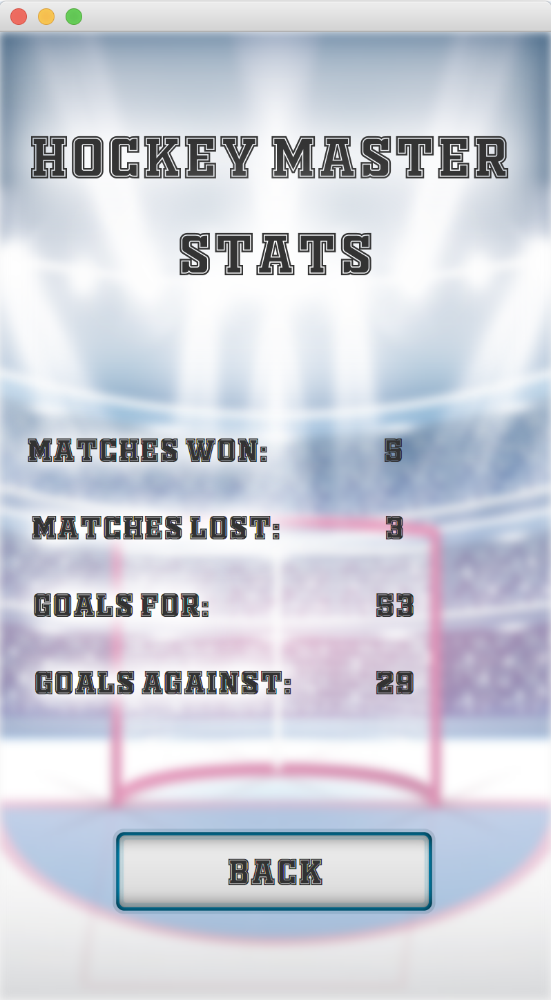
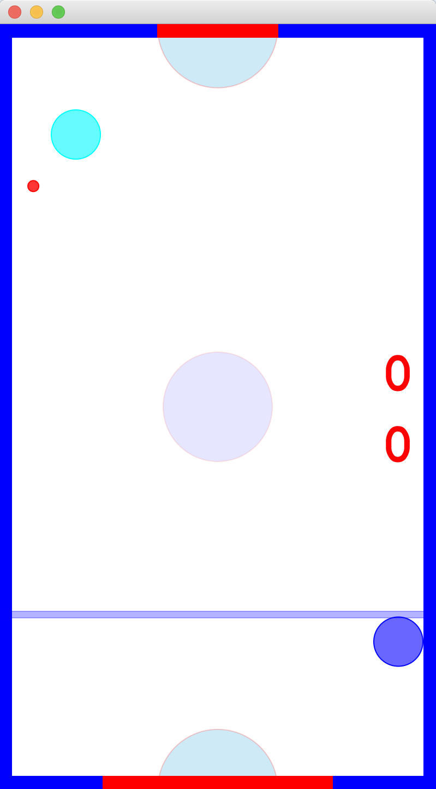

<!-- Copy and paste the converted output. -->
<!-----
    NEW: Check the "Suppress top comment" option to remove this info from the output.
    
    Conversion time: 7.287 seconds.
    
    
    Using this HTML file:
    
    1. Paste this output into your source file.
    2. See the notes and action items below regarding this conversion run.
    3. Check the rendered output (headings, lists, code blocks, tables) for proper
       formatting and use a linkchecker before you publish this page.
    
    Conversion notes:
    
    * Docs to Markdown version 1.0β29
    * Sun Aug 09 2020 22:27:23 GMT-0700 (PDT)
    * Source doc: Complete Documentation (1)
    * Tables are currently converted to HTML tables.
    * This document has images: check for >>>>>  gd2md-html alert:  inline image link in generated source and store images to your server. NOTE: Images in exported zip file from Google Docs may not appear in  the same order as they do in your doc. Please check the images!
    
    
    WARNING:
    You have 7 H1 headings. You may want to use the "H1 -> H2" option to demote all headings by one level.
    
    ----->
<h1>Hockey Master</h1>
<h2>Team Members</h2>

    Mingyu Cui, mingyucu@usc.edu

    Richard Cong, rcong@usc.edu

    Yu Zheng, zhen405@usc.edu

    Mark Kinol, kinol@usc.edu

<h2>Proposal: Hockey Master</h2>

    Description: JavaFX game of air hockey with powerups (Move midline, increase goal size, decrease puck size). Single player and multiplayer or 2v2. A server will be used to play multiplayer across different devices. End game when a certain score or time limit is reached. Special levels include larger goals, faster strikers, or multiple pucks. Multi-threaded code will be used to control multiple strikers and the puck at the same time.

<h2>High Level Requirements</h2>

    We need to create a Java Swing game of Air Hockey where players can play against other players online. There will be dropped items to gain perks (make opponent’s screen dark, reduce speed of opponent’s striker, increase size of own striker etc.). End game when a player scores 7 goals or time limit is reached. Special stages include larger goals, faster strikers, or multiple pucks. Multi-threaded code will be used to communicate game states between players.

<h2>Technical Specifications</h2>
<h2>MySQL Database (6 hours)</h2>
<ul>
    <li>The database will consist of two tables – a Player table and a Match table. 
    <li>The Player table will be used for player login and and consist of playerID, username, password, matchesWon, matchesLoss, goalsFor, goalsAgainst
    <li>The Match table will consist of player1ID, player2ID, a timestamp, winner, and score</li>
</ul>
<h2>Backend Servlets (4 hours)</h2>
<ul>
    <li>Enable JDBC connection to database
    <li>Allow registering new Player, logging into existing Player, adding new Match record, retrieving Match history of Player</li>
</ul>
<h2>Game Interface (8 hours)</h2>
<ul>
    <li>The user will first be presented with a main menu. This menu will include a login and register button.
    <li>There will be a form to submit a username and password to be verified. If the user provides an invalid username or password, they will be present with an error message. Once they enter a valid username and password, they will be redirected to the next manu described below.
    <li>The other button will be the option to “Register.” If the user does not have an account yet they can use this button to toggle to the register page which will create a new account (if the username has not yet been used) and automatically sign them in and redirect them to the next menu. 
    <li>Once login is successfully completed, the user will be directed to a new page that has two buttons, “Play”, “Stats”, and  “Sign Out”. Clicking on “Play” will place the player into a queue where they will be paired up by the server into a 1v1 match. Clicking on “Stats” will display the statistics that are recorded in the database. Clicking on “Sign Out” will sign out the player and direct them to the main menu. Once a match is initiated, both players will be redirected to the gameplay screen.
    <li>The statistics screen will simply list the recorded stats we have about each player. There will then be a button “Back” that will bring the user back to the previous screen.  
    <li>The gameplay screen will display the two “Strikers” and one puck. There will also be a two slots that represent the goals and an outline of the board that will act as the bumpers/walls. The score will be displayed in the top center of the screen.</li>
</ul>
<h2>Gameplay Logic (6 hours)</h2>
<ul>
    <li>The puck and strikers will have a specified mass
    <li>The speed of the striker will be determined by how fast the player moves his mouse
    <li>The mass and speed of the puck and striker will determine how fast the puck moves
    <li>The angle at which the puck is hit will determine the direction the puck moves
    <li>When hitting a wall or object the puck will be deflected at a certain angle
    <li>Power-ups can change the size of strikers/puck, add obstacles, or obstruct the view of the other player
    <li>Player 1’s striker should not be able to cross the midway line to Player 2’s side and vice versa
    <li>First player to 7 goals is the winner</li>
</ul>
<h2>Multithreading (4 hours)</h2>
<ul>
    <li>Make sure two players can interact with server properly
    <li>Send current game state to the server and retrieve opponent’s game state</li>
</ul>
<h2>Networking (4 hours)</h2>
<ul>
    <li>Match players in the queue to start a game
    <li>Websocket used for two-way communication between client and server
    <li>The client sends current game state to the server
    <li>The server sends updated game state back to client</li>
</ul>
<h2>Graphic Design (6 hours)</h2>
<ul>
    <li>The background will be black
    <li>The puck will be white
    <li>The strikers will be slightly larger than the puck and be the shape of a ring and they will be different colors than the puck. This will allow the puck and strikers to be differentiated.</li>
</ul>
<h2>Detailed Design</h2>
<h2>PageMap</h2>

    

<h2>GUI Mockup</h2>

    Clearly the menus and gameplay will look sharper when coded in JavaFX. Additionally, the color schemes may differ if we agree other colors work better together. However, this GUI mockups give a good general idea of how each page will look.

<h3>Main Menu</h3>
<h3>
    
</h3>
<h3>Register Page</h3>
<h3>
    
</h3>
<h3>Login Page</h3>
<h3>
    
</h3>
<h3>LoggedInMenu Page</h3>

    

<h3>Statistics Page</h3>

    

<h3>Waiting Page</h3>

    

<h3>Game Screen</h3>
<h3>
    
</h3>
<h3>Game Screen when all 3 types of Power Ups are activated</h3>
<h3>
    
</h3>
<h3>Game Over Page</h3>

    

<h2>Classes and Objects</h2>
<table>
    <tr>
        <td><strong>Class - Description</strong>
        </td>
        <td><strong>Methods</strong>
        </td>
        <td><strong>Variables</strong>
        </td>
    </tr>
    <tr>
        <td>Game: Contains settings and manages threads.
        </td>
        <td>
            main(): starts application
            

                startGame(): start server, create table, players, pucks, strikers, calls drawAll() from draw class
        </td>
        <td>Settings variables such as table size, table friction, striker size, puck size, etc.
        </td>
    </tr>
    <tr>
        <td>Table: Platform for strikers and puck.
        </td>
        <td>checkGoals(): checks whether puck entered a goal
        </td>
        <td>Size and friction values
        </td>
    </tr>
    <tr>
        <td>Puck: Moves around on table.
        </td>
        <td>
            move(): updates location according according to location, speed, and acceleration
            

                collision(): takes object as parameter and determines whether puck has collided with the object. It will update the pucks direction and speed accordingly.
        </td>
        <td>Location and speed
        </td>
    </tr>
    <tr>
        <td>Striker: Used to hit the puck.
        </td>
        <td>move(): update location
        </td>
        <td>Location
        </td>
    </tr>
    <tr>
        <td>Item: Power-ups on table that can be activated by hitting the puck at it. We may end up creating a class for each type of power-up.
        </td>
        <td>activate(): active the effects of the powers-up
        </td>
        <td>None required
        </td>
    </tr>
    <tr>
        <td>Player: Controls the striker.
        </td>
        <td>
            moveStriker(): moves the striker according to user input, calls striker’s move() method
            

                score(): increment player’s score when the puck enters opposing player’s goal
        </td>
        <td>Striker, score
        </td>
    </tr>
    <tr>
        <td>Draw: Draws all objects onto the display. May need to extend Thread; it has to draw every time something moves. 
        </td>
        <td>
            draw(): takes object and location and draws it to the display
            

                drawAll(): draws all objects every instance
        </td>
        <td>None
        </td>
    </tr>
    <tr>
        <td>JDBC: We will have a jdbc class to communicate with the database.
        </td>
        <td>
            register(): register user from database
            

                login(): login to user in database
            

                updateStats(): updates stats of a certain player after a game
        </td>
        <td>None
        </td>
    </tr>
    <tr>
        <td>ServerThread and ClientThread: We will create a class that inherits from thread to manage the communication between server and players
        </td>
        <td>run(): share the state of the game between server and players
        </td>
        <td>None
        </td>
    </tr>
</table>

    *Unless stated otherwise, member variables will all be private and getters and setters for each variable will be implemented. Also, we decided not to create a class diagram because we have very little inheritance and composition of classes is clearly stated in the table.

<h2>Database Schema</h2>

    

    
    

    *The score field in Game table refers to the loser’s score since the winner always has 7 goals.

<h2>Key Algorithms</h2>
<ul>
    <li>Collision with wall: If the distance between the center of the puck and the walls is smaller than or equal to the radius of the puck, update the speed and direction of the puck based on the momentum formula. 
    <li>Collision with striker: If the distance between the center of the puck and the center of the striker is smaller than or equal to the added radius of the puck and the striker, update the speed and direction of the puck based on the momentum formula. 
    <li>Friction:  The speed of the puck decreases by a constant factor
    <li>Goal detection: When the midpoint of the puck passes the goal line, record a goal for the opposite side. </li>
</ul>
<h2>Procedure</h2>

    1) Initialization:

    Define size and location of Puck and Striker.

    Puck: currLoc = center, direction = null,  speed = 0.

    2) Making a Strike:

<ol>
    <li>Player activates moveStriker(), striker moves according to player input.
    <li>
        Enter while loop. While Table.checkGoals() is false: 
        <ol>
            <li>Wait until collision happens
            <li>Update puck movement resulted from either a striker or a bounce.
            <li>
                Activates Puck.move(): calculate trace and execute.
                

                    Reiterate through while loop whenever a new collision occurs. Exit while loop only when puch enters a goal.
                

                

                    3) Table.checkGoals(): When the midpoint of the puck passes the goal line, record a goal for the opposite side. 
                

                

                    4) Go back to step 1) and repeat until one player gets to target score (7).
                

            </li>
        </ol>
    </li>
</ol>
<h2>Items</h2>
<ul>
    <li>Change in mass or friction of the puck - change the acceleration of puck. 
    <li>Change in size of striker or puck - change the way to determine the direction of puck
    <li>Obstacles - change settings in Table.</li>
</ul>
<h2>System Requirement</h2>
<ul>
    <li>JDK 7 or higher
    <li>JRE 7 or higher
    <li>JavaFX
    <li>MySQL and SQL Driver
    <li>Apache Tomcat Server </li>
</ul>
<h2>Testing Document</h2>
<table>
    <tr>
        <td><strong>Test Case</strong>
        </td>
        <td><strong>Method</strong>
        </td>
        <td><strong>Expected Result</strong>
        </td>
    </tr>
    <tr>
        <td><strong>Menu:</strong>
        </td>
        <td>
        </td>
        <td>
        </td>
    </tr>
    <tr>
        <td>1. Create User
        </td>
        <td>Click on the “Register” button on the main page. 
        </td>
        <td>Takes in the info for a user’s username, password, and password confirmation. If username is taken or passwords do not match an error is displayed. User info is added into the database and user is automatically logged in if successful.
        </td>
    </tr>
    <tr>
        <td>2. Login 
        </td>
        <td>Click on the “Login” button on the main page.
        </td>
        <td>Takes the user’s username and password. If incorrect, supply error message, else log user in. 
        </td>
    </tr>
    <tr>
        <td>3. Check Stats
        </td>
        <td>Click on the “Stats” button once the user is logged in.
        </td>
        <td>The user should be directed to a new page that displays the saved stats correctly.
        </td>
    </tr>
    <tr>
        <td>4. Sign out
        </td>
        <td>Click on “Sign out” button once the user is logged in.
        </td>
        <td>The user will no longer be logged in and they will returned to the initial main page.
        </td>
    </tr>
    <tr>
        <td>5. Join game
        </td>
        <td>Click on “Join game” button once the user is logged in.
        </td>
        <td>The user will be entered into a queue and wait until a second player also tried to join a game. Once the second player joins both players will be redirected to the game screen.
        </td>
    </tr>
    <tr>
        <td><strong>Gameplay:</strong>
        </td>
        <td>
        </td>
        <td>
        </td>
    </tr>
    <tr>
        <td>6. Striker Movement
        </td>
        <td>Move the mouse over the gameboard.
        </td>
        <td>The striker should move smooth and responsively based on the movements of the mouse. If the mouse goes off screen the striker should stop where the mouse was last on the screen. The speed of the striker is proportional to the speed of the mouse movement. Both players cannot move their respective striker to the other side of the table.
        </td>
    </tr>
    <tr>
        <td>7. Puck movement
        </td>
        <td>The puck movement is initiated by contact with a striker.
        </td>
        <td>The pucks movement should be smooth and consistent. It should also slow down with a constant deceleration from ‘friction’. The puck’s initial speed should be proportional to the speed at which it is hit by a striker.
        </td>
    </tr>
    <tr>
        <td>8. Puck Collisions w/ walls
        </td>
        <td>The collisons will occur once the puck bounces off the walls.
        </td>
        <td>The puck will bounce off the wall once its outer edge makes contact with the table’s border with the proper physics described in the detailed design document.
        </td>
    </tr>
    <tr>
        <td>8. Puck Collisions w/ striker
        </td>
        <td>The collisons will occur once the puck bounces off the walls.
        </td>
        <td>The puck will bounce off the striker once its outer edge makes contact with the striker’s border with the proper physics described in the detailed design document. Additionally, the angle of the collision will determine the direction of the puck’s movement.
        </td>
    </tr>
    <tr>
        <td>9. Goal Detection
        </td>
        <td>The midpoint of the puck makes contact with the goal line.
        </td>
        <td>Once the center of the puck crosses the goal line the table will be reset and the score will be adjusted for the player who scored. The goal will also be saved into the player’s stats.
        </td>
    </tr>
    <tr>
        <td>
            10. Reset after score
            

        </td>
        <td>After a player has scored.
        </td>
        <td>The player who was scored against will start with the puck on their side of the table. The strikers will both be set back to a restart position. 
        </td>
    </tr>
    <tr>
        <td>11. Item Detection
        </td>
        <td>The edge of the puck makes contact with the item.
        </td>
        <td>The correct item functionality is activated and the effects can be seen on the board.
        </td>
    </tr>
    <tr>
        <td>12. End Game detection
        </td>
        <td>A player has reached 7 points.
        </td>
        <td>Both players will be presented with an end game screen that either says winner or loser. Then both players will be directed back to the logged in page. The win and loss is correctly logged into the appropriate player’s stats.
        </td>
    </tr>
</table>
<h2>Deployment Document</h2>
<ol>
    <li>Install e(fx)clipse from Help->Eclipse Marketplace.
    <li>Download ​and ​install ​the ​program ​ngrok ​from ​ngrok.com.
    <li>Download the JavaFX project HockeyMaster as a .zip file and import it.
    <li>Run ​the ​SQL script ​‘hockeymaster.sql’ in ​MySQL ​Workbench.
    <li>Set ​your ​username ​and ​password ​MySQL ​in SQLConnection.java.
    <li>Download ​and ​install ​the ​program ​ngrok ​from ​ngrok.com.
    <li>
        In Terminal, type “./ngrok ​http ​____” ​where ​____ ​is ​the ​port ​that ​your TomCat ​server ​runs ​on ​(default ​is ​8080).
        <ol>
            <li>Run Master.java in Eclipse (Server).
            <li>Get the ​ngrok ​URL ​from ​ngrok terminal and replace ngrok_url in Hockey.java. ​This ​will ​change every ​time ​you ​restart ​ngrok.
            <li>Run Hockey.java in Eclipse on two computers (Client)
            <li>Start playing!</li>
        </ol>
    </li>
</ol>
